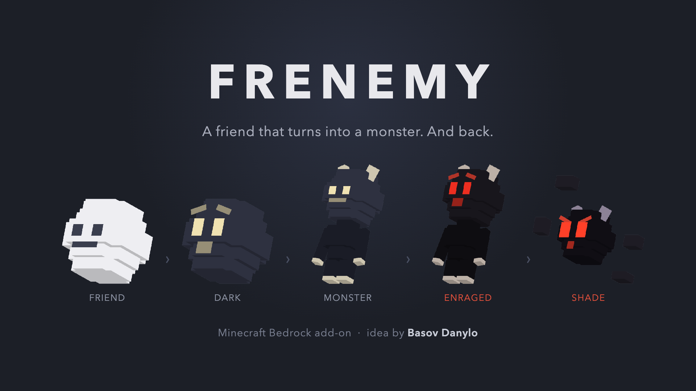

# Frenemy

A Minecraft Bedrock add-on my son came up with.

*Українською: [README.uk.md](README.uk.md).*

Danylo was six when he explained the idea to me. He wanted a friend in
Minecraft: a little white ball that flies after you and talks. But if you hit
it, it turns into a monster and chases you. And a torch turns it back into a
friend. That's the whole game, and I liked it enough to actually build it.

## How it works

You get an egg the moment you enter a world (in Survival too, no creative
inventory needed). Out comes a white orb with a face. It follows you around,
chirps, and if you give it a flower or an apple it's yours: it does a
backflip and sings.

Hit it once and it goes dark. It flies lower, turns away when you come close,
and quietly asks you to stop.

Hit it again and it shakes for a few seconds, then a horned monster with red
eyes comes out and hunts you. Yes, even if it was your tamed pet a minute ago.
Danylo insisted on that part. After about half a minute the monster calms down
and just follows you, muttering. Hit the calm one and it panics, runs, and
comes back angry.

If you keep hitting the angry monster (three quick hits), the body falls apart
and what's left is the Shade: a black core with burning eyes and bits of shell
spinning around it. It's fast, it flies, it bites.

There's always a way back. A torch calms the dark orb and turns a calm monster
into the friend again. A flower brings the Shade straight back to the white
orb. Leave the Shade alone and it burns out on its own after 45 seconds.

A few smaller things: sneak and tap the orb three times, a tamed calm monster
will fight whoever hurts you, and a fermented spider eye turns the orb into a
calm monster without any drama.

## Download

Two files in [Releases](../../releases/latest). They are the same add-on,
only the voice is different:

- `frenemy-en-<version>.mcaddon` with the English voice
- `frenemy-ua-<version>.mcaddon` with the Ukrainian voice

Menus and subtitles come in English and Ukrainian in both.

## Install

1. Open the `.mcaddon` on your device. Minecraft imports both packs on its own.
2. In the world settings turn on both of them: one is under Behavior Packs,
   the other under Resource Packs. This is the step people forget.
3. Restart the game once, otherwise the new sounds don't load.
4. Enter the world. The egg shows up in your inventory within a few seconds.
   If you lose it, craft another one: an egg and a poppy.

Needs Minecraft Bedrock 1.21 or newer. No experimental toggles, so your
achievements keep working.

## Who made it

Idea, character and the whole story: **Basov Danylo**. He also asked for his
name to be on it, so here it is.

Models, textures, sounds and code: his dad, Oleksandr Basov. Everything in
here is ours; nothing is copied from other mods.

## License

[CC BY-NC-ND 4.0](LICENSE). Play it, share the link, put it in your videos.
Please don't sell it, re-upload it to other sites or publish changed versions
without asking.
